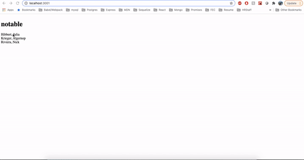

# Notable

> Review calendars for physicians, a web application that returns a full list of physicians and their appointments for the day. Built using JavaScript, React and styled components. Set up server with express.js and began MongoDB connection and schema. Currently makes get request to server for sample data in memory. Uses one get request to support the one to many relationship between physician and patient. 

## Table of Contents

1. [Demo](#demo)
2. [Development](#development)

## Demo



## Development

### Installing Dependencies

From within the root directory:

```sh
npm install -g webpack
npm install
npm start
```

To make changes and recompile webpack bundle:

```sh
npm run build
```